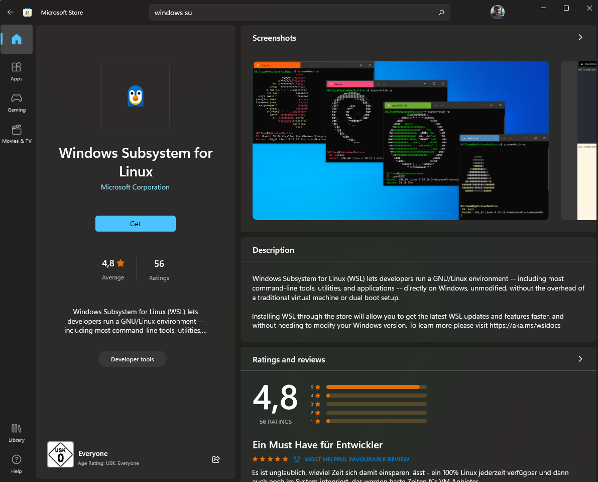

# Docker GUI in Windows 11
## 1. [Virtualization](https://docs.docker.com/desktop/troubleshoot/topics/#virtualization)
- Follow the steps and reboot.

## 2. [WSL2 Install](https://ubuntu.com/tutorials/install-ubuntu-on-wsl2-on-windows-11-with-gui-support#1-overview) 
- Install [WSL2 Linux kernel update package for x64 machines](https://wslstorestorage.blob.core.windows.net/wslblob/wsl_update_x64.msi).
- Install WSL2 preview for GUI
    
- Open powershell and run 
    - `wsl --install`
    - `wsl --set-default-version 2`
    - `wsl --list --online`  to see all available distros.
    - `wsl --install -d Ubuntu-20.04`
    - Use `wsl -l -v` to see all your currently installed distros and which version of WSL they are using.

## 3. [CUDA With WSL2](https://docs.nvidia.com/cuda/wsl-user-guide/index.html#cuda-support-for-wsl-2). (Optional)
- In Ubuntu terminal
    - `sudo apt-key del 7fa2af80`
    - 
    
    ```
    wget https://developer.download.nvidia.com/compute/cuda/repos/wsl-ubuntu/x86_64/cuda-wsl-ubuntu.pin
    sudo mv cuda-wsl-ubuntu.pin /etc/apt/preferences.d/cuda-repository-pin-600
    wget https://developer.download.nvidia.com/compute/cuda/12.0.0/local_installers/cuda-repo-wsl-ubuntu-12-0-local_12.0.0-1_amd64.deb
    sudo dpkg -i cuda-repo-wsl-ubuntu-12-0-local_12.0.0-1_amd64.deb
    sudo cp /var/cuda-repo-wsl-ubuntu-12-0-local/cuda-*-keyring.gpg /usr/share/keyrings/
    sudo apt-get update
    sudo apt-get -y install cuda
    ```
## 4. [Install Docker](https://docs.docker.com/desktop/install/windows-install/)
- To fix internet access issue follow: https://learn.microsoft.com/en-us/windows/wsl/networking#accessing-a-wsl-2-distribution-from-your-local-area-network-lan
- Docker Setting --> General --> Enable --> "Use the WSL2 based engine" and "Use docker Compose V2"
- Docker Setting --> Rersource --> WSL Integration and enable it.
- For GUI mount volume from `\\wsl.localhost\Ubuntu-20.04\mnt\wslg`: `/tmp`
